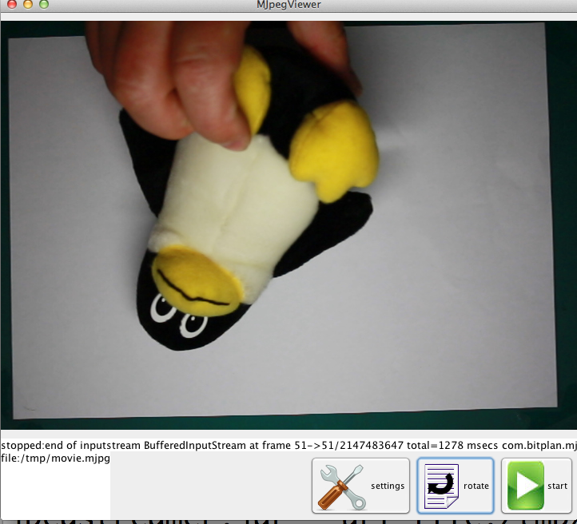
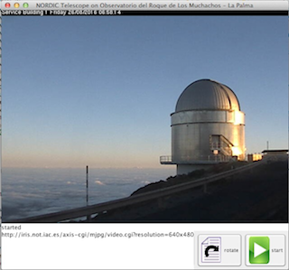
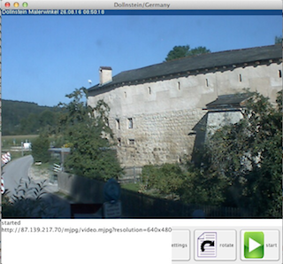

# com.bitplan.mjpegstreamer
Java library for handing MJPEG streams - can e.g. display stream from a Webcam as a preview

## Screenshot


# Project
[](https://travis-ci.org/BITPlan/com.bitplan.mjpegstreamer)
* Issues via https://github.com/BITPlan/com.bitplan.mjpegstreamer/issues
* Apache License
* Open Source hosted at https://github.com/BITPlan/com.bitplan.mjpegstreamer
* Maven based Java project including JUnit 4 tests.

### Distribution
Available at Maven Central see 

http://search.maven.org/#artifactdetails|com.bitplan|com.bitplan.mjpegstreamer|0.0.3|jar

Maven dependency:

```xml
<dependency>
  <groupId>com.bitplan</groupId>
  <artifactId>com.bitplan.mjpegstreamer</artifactId>
  <version>0.0.3</version>
</dependency>
```

## Usage
```
java -jar mjpegstreamer.jar --help
Help
MJpegViewer Version: 0.0.3

 github: https://github.com/BITPlan/com.bitplan.mjpegstreamer

  usage: java com.bitplan.mjpegstreamer.MJpegViewer
 -ac (--autoclose)      : auto close
                          close when stream is finished
 -d (--debug)           : debug
                          adds debugging output
 -h (--help)            : help
                          show this usage
 -o (--overlay)         : adds a rectangle overlay
 -r (--rotation) N      : rotation e.g. 0/90/180/270 degrees
 -rto (--readtimeout) N : readtimeout in milliseconds
                          default is 5000 millisecs
 -s (--start)           : auto start
                          start streaming immediately
 -t (--title) VAL       : title
                          title to be used
 -u (--url) VAL         : url
                          url to be used
 -v (--version)         : showVersion
                          show current version if this switch is used
```
## Examples
java -jar mjpegstreamer.jar --url http://iris.not.iac.es/axis-cgi/mjpg/video.cgi?resolution=640x480 --start --title "NORDIC Telescope on Observatorio del Roque de Los Muchachos - La Palma"



java -jar mjpegstreamer.jar --url http://87.139.217.70/mjpg/video.mjpg?resolution=640x480 --start --title "Dollnstein/Germany"



see http://www.insecam.org for more publicly accessible test cameras

## Installation
```
git clone https://github.com/BITPlan/com.bitplan.mjpegstreamer
mvn install
```
to use as a library 

```
mvn clean compile assembly:single
```
to create a standalone jar

## Test
```
mvn test
...
Tests run: 9, Failures: 0, Errors: 0, Skipped: 0
```

## Version history
* 0.0.1: 2013       Internal Project at BITPlan
* 0.0.3: 2016-08-25 Released as Open Source Project
